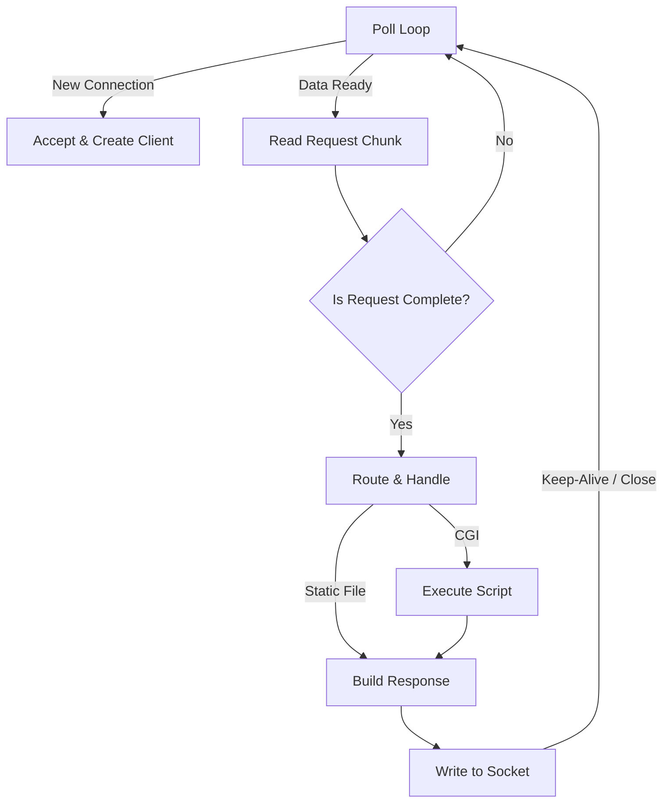

*This project has been created as part of the 42 curriculum by cabo-ram, cayamash and naharumi.*

# 42-webserv

**Webserv** is a custom **HTTP/1.1** server implemented in C++98. The main objective of this project is to understand the internal mechanics of a web server by implementing everything from scratch: socket handling, I/O multiplexing, HTTP parsing, routing, and CGI execution.

Inspired by Nginx, our server is capable of hosting static websites, handling file uploads, executing CGI scripts, and supporting multiple virtual servers through a flexible configuration system.

Through this project, we learned how to:
* Build a full HTTP server from raw TCP sockets
* Handle multiple clients concurrently using I/O multiplexing
* Parse and validate HTTP/1.1 requests
* Route requests based on server and location configuration
* Generate correct HTTP responses and error codes
* Execute CGI programs and integrate their output
* Design a scalable, non-blocking event-driven architecture

<br>

## 🌐 Features

**Core Server Features**
* **I/O Multiplexing** using `poll()` for efficient handling of multiple concurrent connections
* **Non-blocking I/O** to prevent slow clients from blocking the server
* **Supported HTTP Methods**: `GET`, `POST`, `DELETE`
* **Static File Serving**: HTML, CSS, JavaScript, images, etc.
* **Directory Listing** with optional autoindex
* **Custom Error Pages** for HTTP errors (404, 405, 500, etc.)
* **Client Body Size Limit** configurable to prevent oversized uploads

**Bonus Features**
* **Session & Cookie Management**: state persistence across requests using internal session storage and Set-Cookie headers
* **Multiple CGI Support**: execute different CGI languages based on configuration

<br>

## 🧱 Architecture

**Server**
* Listens on configured ports
* Accepts incoming connections

**Client**
* Represents a connected socket
* Handles reading requests and sending responses

**Request**
* Parses raw HTTP data
* Extracts method, headers, body, and target path

**Response**
* Builds valid HTTP responses
* Manages headers, status codes, and body

**CGI Handler**
* Executes external scripts via fork() and execve()
* Passes environment variables
* Captures stdout and converts it into an HTTP response

All components are orchestrated by a central poll-based event loop.

We chose `poll()` for its better scalability and cleaner interface. It allows us to monitor a large number of file descriptors for events (POLLIN, POLLOUT), while still maintaining high portability across Unix-like systems.

All sockets operate in non-blocking mode. Data is read and written in chunks, and each connection progresses through well-defined states. This ensures that:
* A slow client cannot block the server
* Large uploads or CGI executions do not freeze the event loop
* The server remains responsive under load

The following diagram illustrates the main event-driven flow of the server:


<br>

## 💻 Usage

* Compile the project 
    ```sh
    make
    ```

* Run the program providing the path of the server configuration file as argument:
    ```sh
    ./webserv <config_file>
    ```

<br>

**Configuration File Example**

Below is an example of a real configuration used in our Webserv implementation, showcasing redirects, CGI execution, custom error pages, and per-route method control:

```
server {
	host 127.0.0.1;
	listen 8084;
	server_name ninjas_server;

	root ./data/ninjas_server;
	index index.html;

	client_max_body_size 5000000;

	error_page 403 /errors/403.html;
	error_page 404 /errors/404.html;
	error_page 405 /errors/405.html;
	error_page 500 /errors/500.html;

	location / {
		methods GET;
	}

	location /fast {
		return 302 /silent;
	}

	location /silent {
		cgi .py /usr/bin/python3;
		root ./data/ninjas_server/cgi;
		index silent.py;
		methods GET POST;
	}

	location /deadly {
		methods GET;
		root ./data/ninjas_server/deadly;
	}

	location /forbidden {
		return 403;
	}
}
```

* Support for:
    - Multiple `server` blocks
    - Multiple `location` blocks per server
    - Per-route method restrictions
    - Root, index, error pages and upload paths
    - HTTP redirections using `return`
    - CGI executor path

Configuration inheritance follows a clear priority order: location → server → default values

<br>

## 🧪 Testing

You can test the server using:
* **Web browsers** (Chrome, Firefox, etc.)
* **curl:** curl -X GET http://localhost:8084
* **Siege** or similar tools for load testing and validating non-blocking behavior
